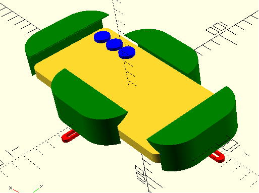

# Работа Горбуновой Арины
# Проект "Цифровой окуляр микроскопа" на языке OpenScad

Модель для 3D-печати универсального захвата и окуляра для школьного микроскопа ШМ-1, которые закрепляеться на тубусе 
микроскопа. Захват позволяет совместить оптическую ось объектива камеры смартфона с оптической осью окуляра микроскопа.

Исходная модель захвата:
 в репозитории на GitHub 
Universal Phone Microscope Adapter.

# Фотографии напечатанной модели